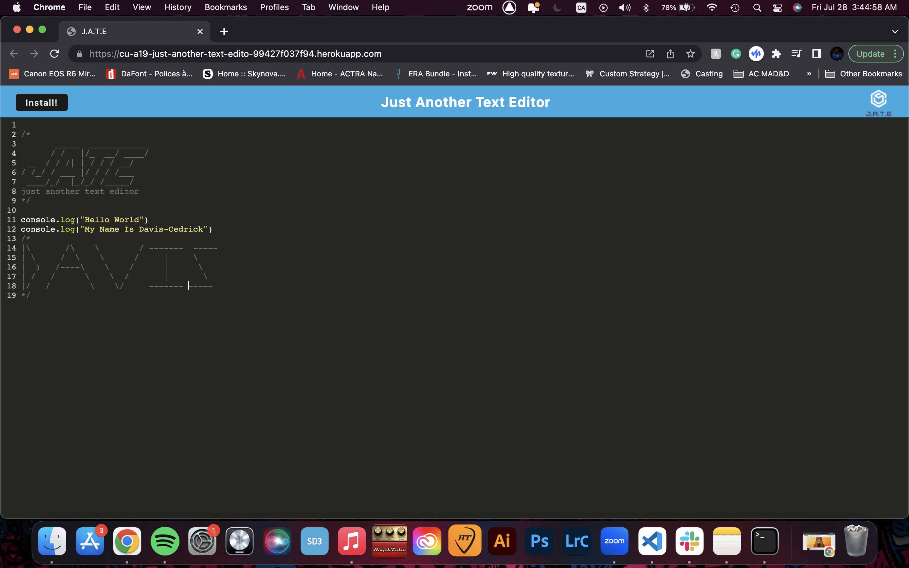

# Text Editor Starter Code

## Table Of Contents
- Description Of the Contents
- How To Install
- link of The Deployed Application
- Screenshot
- Built
- Creator & License

## Description Of the Contents
- This app takes an existing text editor app (like Notepad+++) and adds features for it to work as a PWA. This application is deployed through Heroku.

## How To Install
1. git clone the repo to your local machine. To use this application
2. run the command to install the dependencies:
- npm install Then run the following command:
- npm run start:dev

## link of The Deployed Application

[Link to the Deployed Repo](https://cu-a19-just-another-text-edito-99427f037f94.herokuapp.com/)

## Screenshot

## Built

This project was built using...
- Javascript 
- Node.js 
- Inquirer 
- MYSQL

## Creator & License
Creator: Davis-Cedrick Baseka

MIT License

Copyright (c) 2023 Davis-Cedrick Baseka
